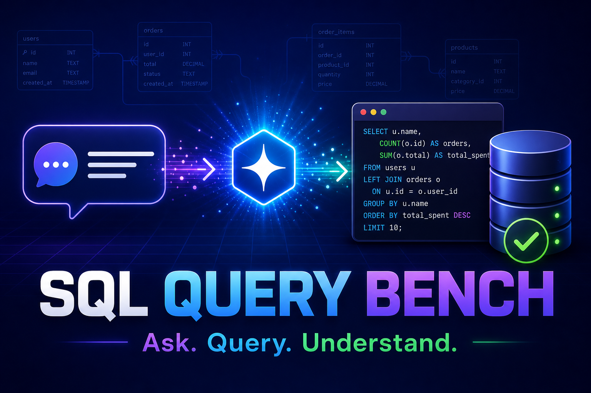

# Query Bench

**Ask questions of a real SQL database using OpenAI Codex and natural language.**

Query Bench connects to a user-configured relational database, inspects its live
schema, generates read-only SQL, validates it, executes it, and explains the
result. Users can also upload database-specific context—business rules, metric
definitions, data dictionaries, relationship notes, and example SQL—to improve
the accuracy of each answer.

Built for **OpenAI Build Week**.



## Why Query Bench?

Business users know the questions they want to ask, but they may not know table
names, join paths, SQL syntax, or database-specific conventions. A one-shot
text-to-SQL prompt can also produce convincing SQL that uses the wrong field or
misunderstands a business term such as "net sales."

Query Bench turns text-to-SQL into an observable workflow:

1. Understand the user's question and database context.
2. Search the live database schema for relevant tables and columns.
3. Generate a read-only SQL query.
4. Validate the SQL before execution.
5. Execute it against the connected database.
6. Return the SQL, rows, summary, insights, and suggested follow-up questions.

## Highlights

- **Sign in with OpenAI** using OAuth device authorization—no API key entry.
- **Dynamic model selection** based on the Codex models available to the signed-in account.
- **Bring your own database** with locally saved connection profiles.
- **Live schema discovery** instead of relying on a hard-coded schema.
- **Database Context** uploads for business terminology and organization-specific rules.
- **Iterative function-calling loop** for discovery, SQL generation, validation, and execution.
- **Live SSE progress** so users can follow the workflow while Codex is working.
- **Schema Explorer** for tables, columns, keys, and relationships.
- **Dashboard and query logs** for status, response time, model, tokens, and estimated cost.
- **Analytics** for visualizing and exporting query results.
- **Read-only protection** with validation and single-statement enforcement.
- PostgreSQL, MySQL, SQL Server, and Oracle support.

## Demo

[Watch the Query Bench demo on YouTube](https://youtu.be/TfStYcYwgA4)

Suggested demonstration question:

> Show me monthly revenue, refunds, discounts, and net sales. Highlight the
> strongest month and any unusual refund trends.

## Architecture

```text
Angular UI (localhost:1111)
        |
        | REST + Server-Sent Events
        v
FastAPI backend (localhost:2222)
        |
        +-- OpenAI OAuth and dynamic Codex model discovery
        +-- Iterative OpenAI function-calling orchestrator
        +-- Database context service
        +-- Schema discovery and SQL validation functions
        +-- Query logging and analytics
        |
        v
SQLAlchemy connection pools
        |
        v
PostgreSQL / MySQL / SQL Server / Oracle
```

For the web application, the backend converts its registered database tools
into OpenAI function definitions. Codex chooses a function, the backend executes
it, returns the result, and repeats the loop until the answer is ready.

The same registry is MCP-compatible and can optionally be exposed over stdio or
Streamable HTTP for external MCP clients. The web chat does not require a
separate remote MCP connection.

## OpenAI Build Week quick start

### Prerequisites

- Python 3.10 or newer
- Node.js 18 or newer
- npm
- A reachable PostgreSQL, MySQL, SQL Server, or Oracle database
- An OpenAI account with Codex access

### 1. Clone the repository

```bash
git clone https://github.com/iamkiranrajput/query-bench.git
cd query-bench
```

### 2. Start the backend

```powershell
cd server
python -m venv venv
.\venv\Scripts\Activate.ps1
pip install -r requirements.txt
Copy-Item .env.example .env
python main.py
```

For Linux or macOS, activate the environment with:

```bash
source venv/bin/activate
```

The API runs at `http://localhost:2222`. Interactive API documentation is
available at `http://localhost:2222/api/docs`.

### 3. Start the UI

Open another terminal:

```bash
cd ui
npm install
npm start
```

Open `http://localhost:1111`.

### 4. Use Query Bench

1. Open **Settings** and add a database connection.
2. Open **OpenAI Codex** and select the settings icon.
3. Choose **Sign in with OpenAI** and approve the device code in your browser.
4. Select one of the Codex models available to your account.
5. Optionally upload a database context file.
6. Ask a question in natural language and follow the live progress.

## Connecting Supabase

Supabase's direct database endpoint is IPv6 by default. If your computer or
hosting environment is IPv4-only, use the **Supavisor Session Pooler** details
from the Supabase **Connect** dialog:

- Host: the supplied `*.pooler.supabase.com` hostname
- Port: `5432` for session mode
- Database: usually `postgres`
- Username: copy the complete pooler username from Supabase
- Password: enter the raw database password, not its URL-encoded representation

Transaction mode on port `6543` is also available for short-lived connections.
Never commit or publish a database password or connection string.

## Database Context

Upload `.md`, `.txt`, `.json`, `.yaml`, `.csv`, or `.sql` files containing:

- business terminology and abbreviations;
- metric definitions;
- table and column descriptions;
- verified relationships and join paths;
- data-quality rules; and
- example SQL.

Files are scoped to the selected database, stored locally under
`server/data/user_contexts/`, and excluded from Git. Context is treated as
guidance; the live schema and live query results remain authoritative.

## Function-calling workflow

The Codex orchestration loop can use functions in these categories:

| Category | Examples |
| --- | --- |
| Discovery | `search_tables`, `search_columns`, `introspect_schema`, `preview_data` |
| Relationships | `check_relationships`, `discover_join_paths` |
| SQL lifecycle | `generate_sql`, `validate_sql`, `execute_sql`, `explain_sql`, `fix_sql` |
| Database capabilities | `detect_extensions`, `validate_server_compatibility` |
| Connection context | `switch_database`, `get_connection_profile` |

The backend bounds the number of iterations and the total wall-clock time. Tool
results are returned to Codex after each step, while progress events are streamed
to the UI using Server-Sent Events.

## Safety and local data

- AI-generated database execution is restricted to `SELECT` queries.
- SQL passes through keyword blocking, injection checks, and single-statement validation.
- Database context files remain local and are excluded from Git.
- OpenAI OAuth credentials are encrypted at rest using Windows DPAPI or AES-GCM.
- Database passwords are stored encrypted in the browser's local storage.
- SSH credentials, when used, are injected by the backend and are not exposed to the model.

Use a read-only database account with the minimum permissions required for the
tables that Query Bench should access.

### Repository data hygiene

The repository does not include database credentials, OAuth tokens, uploaded
customer context, query-history databases, or application logs. Local runtime
files such as `server/.env`, `server/app/data/.copilot_token.json`,
`server/data/user_contexts/`, `server/data/*.db`, and `server/logs/` are covered
by Git ignore rules. Review `git status` before every public push and rotate any
credential that has ever been displayed or shared outside the local machine.
Before recording or sharing a browser profile, use **Clear All** in Chat History
to remove locally stored conversations and verify that connection details are
not visible on screen.

## Demo database

The `demo/` directory includes a PostgreSQL retail dataset with customers,
orders, products, and stores. PostGIS and pgvector features are optional.

### Docker

```powershell
cd demo
$env:POSTGRES_PASSWORD = "<choose-a-strong-password>"
docker compose up --build -d
$env:DEMO_DB_PASSWORD = $env:POSTGRES_PASSWORD
python seed_embeddings.py
```

Connect Query Bench to `localhost:5433`, database `querybench_demo`, and user
`querybench`.

### Hosted PostgreSQL or Supabase

Run [`demo/setup_hosted.sql`](demo/setup_hosted.sql) in the database's SQL
editor or with `psql`:

```bash
psql "<connection-string>" -f demo/setup_hosted.sql
```

If PostGIS or pgvector is unavailable, Query Bench continues to support normal
relational queries.

## Optional MCP exposure

The function registry can also be used by external MCP clients.

### stdio

```json
{
  "servers": {
    "query-bench": {
      "command": "python",
      "args": ["server/mcp_stdio_server.py"],
      "type": "stdio"
    }
  }
}
```

### Streamable HTTP

Set `MCP_HTTP_ENABLED=true` in `server/.env`, configure its authentication, and
connect an MCP client to `http://localhost:2222/mcp`.

## Project structure

```text
query-bench/
|-- server/                  FastAPI backend
|   |-- main.py              Application entry point
|   |-- mcp_stdio_server.py  Optional MCP stdio entry point
|   |-- app/
|       |-- routes/          REST and SSE endpoints
|       |-- services/        Codex, database, context, and logging services
|       |-- mcp_server/      Function registry and SQL tools
|-- ui/                      Angular 17 frontend
|-- demo/                    Demo database schema and seed scripts
|-- assets/                  README and submission assets
|-- README.md
```

## Technology

- **AI:** OpenAI Codex models through OpenAI OAuth and function calling
- **Frontend:** Angular 17, Angular Material, Tailwind CSS, RxJS
- **Backend:** Python, FastAPI, HTTPX, Pydantic
- **Database:** SQLAlchemy and database-specific drivers
- **Streaming:** Server-Sent Events
- **Optional interoperability:** MCP Python SDK
- **Security:** Windows DPAPI or AES-GCM through `cryptography`

## Documentation

- [Backend documentation](server/README.md)
- [Frontend documentation](ui/README.md)
